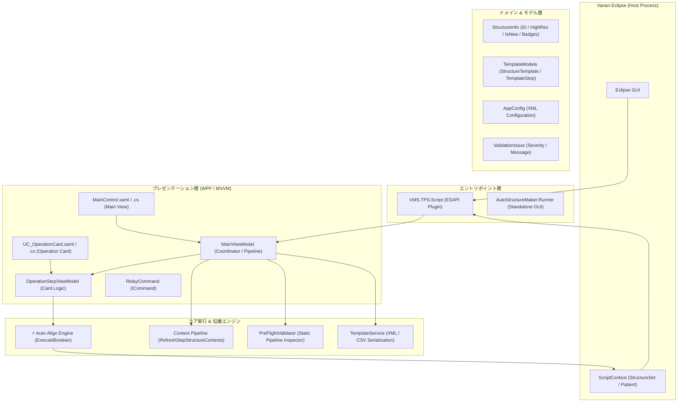
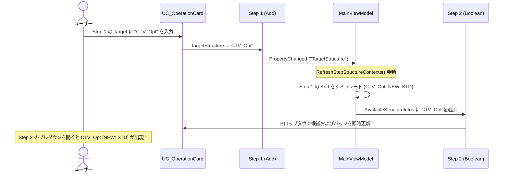
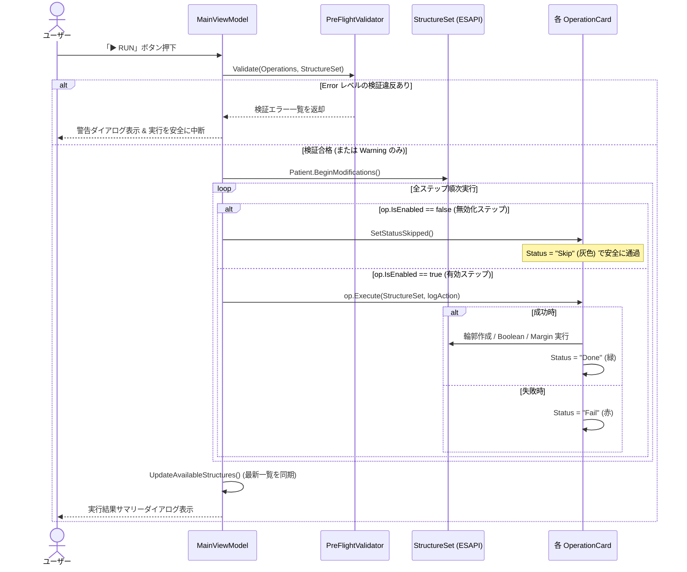

# AutoStructureMaker コード全体構造・アーキテクチャ解説資料

本資料は、Varian Eclipse 輪郭自動作成・編集支援プラグイン **AutoStructureMaker (v2.0 / ESAPI v15.6・v16.1 対応)** のソフトウェアアーキテクチャ、設計パターン、コンポーネント間の責務分担、データフロー、およびテスト基盤を体系的に解説した技術資料です。

---

## 目次

1. [システム概要とコア設計思想](#1-システム概要とコア設計思想)
2. [全体アーキテクチャ図](#2-全体アーキテクチャ図)
3. [ソリューション & ディレクトリ構造](#3-ソリューション--ディレクトリ構造)
4. [レイヤー別詳細設計](#4-レイヤー別詳細設計)
   - 4.1 [エントリポイント層 (Host Integration)](#41-エントリポイント層-host-integration)
   - 4.2 [プレゼンテーション層 (WPF / MVVM)](#42-プレゼンテーション層-wpf--mvvm)
   - 4.3 [先行ステップ輪郭伝播パイプライン](#43-先行ステップ輪郭伝播パイプライン)
   - 4.4 [⚡ Boolean Auto-Align（解像度自動整合）エンジン](#44--boolean-auto-align解像度自動整合エンジン)
   - 4.5 [実行前一括検査エンジン (Pre-Flight Validator)](#45-実行前一括検査エンジン-pre-flight-validator)
   - 4.6 [テンプレート・永続化層 (Template Service)](#46-テンプレート永続化層-template-service)
   - 4.7 [設定基盤 (Configuration)](#47-設定基盤-configuration)
5. [主要データフローと実行シーケンス](#5-主要データフローと実行シーケンス)
   - 5.1 [ステップ編集 & リアルタイム輪郭伝播シーケンス](#51-ステップ編集--リアルタイム輪郭伝播シーケンス)
   - 5.2 [輪郭操作一括実行シーケンス（Pre-Flight & スキップ連動）](#52-輪郭操作一括実行シーケンスpre-flight--スキップ連動)
6. [型安全性・例外安全性の設計 (Zero-Crash)](#6-型安全性例外安全性の設計-zero-crash)
7. [単体テスト自動化基盤 (`AutoStructureMaker.Tests`)](#7-単体テスト自動化基盤-autostructuremakertests)

---

## 1. システム概要とコア設計思想

AutoStructureMaker は、Varian 社製放射線治療計画装置 Eclipse の ESAPI (Eclipse Scripting API) 上で動作する Write-Access 型のバイナリプラグインです。

### コア設計思想
1. **堅牢性と例外安全性 (Zero-Crash Principle)**:
   ユーザー入力やテンプレート内のパラメータ不備（文字列の誤入力、マイナス値、存在しない輪郭名、空輪郭、承認済みロック輪郭など）があっても、Eclipse ホストプロセスを巻き込むクラッシュ（`FormatException`、`NullReferenceException` 等）を絶対に引き起こさない。
2. **直感的な統合操作環境 (Unified Card UI)**:
   従来の 4 つの個別 UI を廃止し、操作カテゴリー（Add / Delete / Boolean / Margin / HiRes）を動的に切り替え可能な単一の操作カード ViewModel に一本化。有効/無効トグル（`IsEnabled`）やワンクリック複製（`Duplicate`）を標準装備。
3. **スマートな解像度バリアフリー (⚡ Auto-Align)**:
   ESAPI の技術的ハードルである「異なる解像度タイプ（Standard 256×256 と High 512×512）の混在による Boolean 演算エラー」を完全自動で解決し、ユーザーに解像度を意識させない安全な透過的処理を提供。
4. **ステップ間コンテキストの自動伝播 (Context Auto-Propagation)**:
   先行ステップで定義された新規輪郭をリアルタイムにシミュレートし、後続ステップのドロップダウン候補に自動追加することで、手入力の手間とタイポ（入力ミス）を根絶（無効化ステップは適切に除外）。
5. **実行前自動検証 (Pre-Flight Validation)**:
   実行前または「✔ Check」ボタン押下時に、未定義輪郭の参照、空入力、重複作成、自己減算等のパイプライン不整合を一括自動検出し、事故を未然に防止。
6. **テスト容易性 (Testability)**:
   ESAPI API が存在しない開発・CI 環境でも、UI ロジック、テンプレート変換、マージンパース、輪郭伝播、解像度整合判定、事前検証を自動検証できる単体テスト基盤（全40テスト）を完備。

---

## 2. 全体アーキテクチャ図



---

## 3. ソリューション & ディレクトリ構造

```
AutoStructureMaker/
├── AutoStructureMaker.sln                 # ソリューション定義 (x64 / Release / Debug)
├── packages/                             # NuGet 依存パッケージ (Costura.Fody, MSTest 等)
├── test.bat                              # ワンクリック自動ビルド & 単体テスト実行スクリプト
├── AutoStructureMaker/                   # ESAPI プラグイン本体プロジェクト
│   ├── AutoStructureMaker.csproj
│   ├── Script.cs                         # ESAPI プラグインエントリポイント (Execute)
│   ├── AutoStructureMaker.config.xml     # 施設設定ファイル (既定値 / 共有パス)
│   ├── Theme.xaml                        # 統一デザインテーマ・スタイルリソース
│   ├── MainControl.xaml / .cs            # メイン画面ビュー (上部バー・カードリスト・ログ)
│   ├── UC_OperationCard.xaml / .cs       # 統合操作カードビュー (動的パラメータ切替・バッジ)
│   ├── Common/
│   │   ├── AppConfig.cs                  # XML 設定ファイルの読み書き・UNCタイムアウト制御
│   │   ├── PreFlightValidator.cs         # 実行前パイプライン一括検証エンジン
│   │   ├── StructureInfo.cs              # 輪郭情報モデル (解像度・バッジ配色・新規判定)
│   │   ├── TemplateModels.cs             # XML 構造化テンプレートの POCO モデル (Enabled属性対応)
│   │   └── TemplateService.cs            # XML / CSV 相互シリアライザ & パラメータパーサー
│   └── ViewModels/
│       ├── ViewModelBase.cs              # INotifyPropertyChanged 基底クラス
│       ├── RelayCommand.cs               # ICommand 実装
│       ├── OperationItemViewModel.cs     # 操作ステップ基底 & 統合 ViewModel (IsEnabled/Duplicate対応)
│       └── MainViewModel.cs              # メイン ViewModel (輪郭伝播・事前検証・実行制御)
├── AutoStructureMaker.Runner/            # スタンドアロン実行・デバッグ用プロジェクト
└── AutoStructureMaker.Tests/             # 自動単体テストプロジェクト (全40テスト 100% PASS)
    ├── AutoStructureMaker.Tests.csproj
    ├── MainViewModelTests.cs             # 伝播・コレクション同期・複製・検証テスト (9件)
    ├── OperationStepViewModelTests.cs    # カード切替・解像度バッジ・Auto-Align・ガードテスト (15件)
    ├── PreFlightValidatorTests.cs        # 事前検証エンジンテスト (未定義/重複/空入力等 7件)
    ├── TemplateServiceTests.cs           # XML / CSV 相互変換・Enabled永続化・破損耐性テスト (6件)
    └── AppConfigTests.cs                 # 設定シリアライズ・UNC高速フォールバックテスト (3件)
```

---

## 4. レイヤー別詳細設計

### 4.1 エントリポイント層 (Host Integration)
- **`Script.cs`**: ESAPI の `[Script(IsWriteable = true)]` 属性を持ち、Eclipse から `Execute(ScriptContext context, Window window)` が呼び出されます。
  - `context.StructureSet` を取得して `MainViewModel.StructureSet` に注入。
  - `MainControl` をインスタンス化してモーダルウィンドウのコンテンツとして展開します。

### 4.2 プレゼンテーション層 (WPF / MVVM)
- **`MainViewModel.cs`**:
  - アプリケーション全体の状態管理、実行調整、およびステップ間輪郭伝播パイプラインを担当。
  - `Operations` コレクションの追加・削除・並び替え（`MoveUp`, `MoveDown`）を統括。
- **`OperationStepViewModel.cs`**:
  - `OperationCategory` プロパティ（Add, Delete, Boolean, Margin, HiRes）の変更に応じて、カード内の入力エリアの可視性（Visibility）およびバッジ色を動的に切り替えます。
  - 等方 / 異方マージンの双方向同期プロパティ（`MarginUniformText` $\leftrightarrow$ `X1`, `X2`, `Y1`, `Y2`, `Z1`, `Z2`）を提供。

### 4.3 先行ステップ輪郭伝播パイプライン
ユーザーがステップを編集するたびに、`MainViewModel.RefreshStepStructureContexts()` がバックグラウンドで高速実行されます：

```csharp
public void RefreshStepStructureContexts()
{
    if (_isRefreshingContexts) return;
    _isRefreshingContexts = true;
    try
    {
        // 1. Eclipse から読み込んだ実在輪郭を初期状態としてクローン
        var currentContext = new Dictionary<string, StructureInfo>(StringComparer.OrdinalIgnoreCase);
        foreach (var baseInfo in _baseStructureInfos)
        {
            currentContext[baseInfo.Id] = new StructureInfo(baseInfo.Id, baseInfo.IsHighResolution, baseInfo.DicomType, isNew: false);
        }

        // 2. ステップ 0 から順にコンテキストを伝播・シミュレート
        for (int i = 0; i < Operations.Count; i++)
        {
            var op = Operations[i];

            // ステップ i 開始時点の利用可能輪郭をインプレース同期
            SyncCollection(op.AvailableStructures, currentContext.Keys);
            SyncStructureInfos(op.AvailableStructureInfos, currentContext.Values);
            op.ResolutionMap = currentContext.ToDictionary(k => k.Key, v => v.Value.IsHighResolution, StringComparer.OrdinalIgnoreCase);
            op.NotifyResolutionChanged();

            // ステップ i の操作結果を currentContext に反映して次ステップへ引き継ぐ
            ApplyStepToContext(op, currentContext);
        }
    }
    finally { _isRefreshingContexts = false; }
}
```

### 4.4 ⚡ Boolean Auto-Align（解像度自動整合）エンジン
`OperationStepViewModel.ExecuteBoolean()` は、解像度タイプが異なる輪郭同士の Boolean 処理において、以下の安全な昇格・クリーンアップ機構を提供します：
1. **一時構造体のプレフィックス命名**: `_tA_1`, `_tB_1` などの一意な名前を自動採番（既存輪郭との衝突を回避）。
2. **高解像度昇格**: `temp.SegmentVolume = strA.SegmentVolume; temp.ConvertToHighResolution();`
3. **Target 輪郭の高解像度化**: 出力先が低解像度の場合は高解像度へ昇格し、ボクセル化誤差を防止。
4. **`finally` 保証**: 処理が例外終了した場合でも、生成された一時作業構造体は必ず `structureSet.RemoveStructure()` で消去。

### 4.5 実行前一括検査エンジン (Pre-Flight Validator)
`PreFlightValidator.cs` は、パイプラインの実行前に静的解析を行い、実行時例外や無駄な処理を未然に防ぐ独立バリデーション層です：
- **検査項目**:
  - 輪郭名の未入力（空文字）
  - 未定義・非存在輪郭の参照（先行ステップで作成されておらず、既存 StructureSet にもない輪郭）
  - 同一輪郭の重複 Add 作成
  - 自己減算（`Target = A - A` などの結果が空になる不正な論理演算）
  - 空輪郭（`IsEmpty == true`）の参照警告
  - 承認済み（Approved）または計算済みプラン使用中輪郭への代入警告
- **Severity レベル**:
  - `Error`: 処理続行不可能な致命的不整合（RUN 実行を安全に中断・ブロック）
  - `Warning`: 潜在的な懸念点（ユーザーの注意を喚起するが実行は許容）

### 4.6 テンプレート・永続化層 (Template Service)
- **`TemplateService.cs`**:
  - XML 構造化テンプレート（`StructureTemplate`）とレガシー CSV テンプレートの相互変換を担当。
  - 各ステップの有効/無効状態（`Enabled="true|false"`）を完全にシリアライズ・復元。
  - 不正な CSV 行や破損データが存在しても、例外をスローせず該当行のみを安全にスキップして読み込みを継続。

### 4.7 設定基盤 (Configuration)
- **`AppConfig.cs`**:
  - 施設共通の既定値（DICOM Type、デフォルトマージン量、ファイル名接頭辞など）を XML ファイルから読み込み。
  - ネットワーク共有フォルダ（UNC パス: `\\Server\Share\`）がオフラインの場合でも UI がフリーズしないよう、1000ms の非同期タイムアウトとローカルフォールバック機構を内包。

---

## 5. 主要データフローと実行シーケンス

### 5.1 ステップ編集 & リアルタイム輪郭伝播シーケンス



### 5.2 輪郭操作一括実行シーケンス（Pre-Flight & スキップ連動）



---

## 6. 型安全性・例外安全性の設計 (Zero-Crash)

AutoStructureMaker では、放射線治療計画装置というクリティカルな環境において、**「スクリプトが原因で Eclipse を落とさない」** ことを最優先設計としています：

1. **セーフパース (`int.TryParse` & フォールバック)**:
   マージン値などの文字列入力に対して `int.Parse` は一切使用せず、すべて `int.TryParse` を使用。空文字やアルファベットが入力された場合は設定ファイルのデフォルト値（7mm等）へ安全にフォールバック。
2. **事前重複チェック**:
   `AddStructure` 実行前に `structureSet.Structures.Any(x => x.Id == TargetStructure)` をチェックし、既存輪郭の上書きエラーを未然に防止。
3. **空輪郭（`IsEmpty`）の参照ガード**:
   Boolean や Margin の参照元輪郭にセグメントが存在しない（空の）輪郭が指定された場合、ESAPI 例外を発生させる前に安全に検知し、スキップおよび明示的な警告ログを出力。
4. **承認済み（Approved）・ロック中輪郭の保護**:
   医師によって承認済み、または線量計算済みプランで使用されている輪郭に対して、TargetStructure への書き込みや削除を行おうとした場合、ESAPI 内部例外を捕捉して親切なエラーメッセージを表示し、クラッシュを完全防止。
5. **安全な null ガード**:
   `StructureSet`、`Structure`、`Patient` のインスタンス取得時に厳格な null チェックを実施。

---

## 7. 単体テスト自動化基盤 (`AutoStructureMaker.Tests`)

本プロジェクトには、ESAPI のバイナリ環境に依存せず、CI / CD や開発機上で即座に実行可能な **40 件の自動単体テスト（MSTest）** が完備されています（`test.bat` でワンクリック実行可能）：

| テストクラス | テスト数 | 主な検証項目 |
|:---|:---:|:---|
| **`MainViewModelTests`** | 9 | コマンド（AddStep, MoveUp, MoveDown, Remove, DuplicateStep, ValidatePreFlight）、ステップ番号自動採番、コレクション同期、無効ステップ伝播除外 |
| **`OperationStepViewModelTests`** | 15 | カテゴリー別可視性切替、等方/異方マージン連動、解像度バッジ表示、⚡ Auto-Align 不一致検出、先行ステップ輪郭伝播、Hi-Res 昇格伝播、IsEnabled トグル、空輪郭・ロック輪郭安全ガード |
| **`PreFlightValidatorTests`** | 7 | 存在しない参照輪郭の検出、重複作成エラー、空の輪郭名検出、自己減算警告、空輪郭警告、承認輪郭警告、全ステップ正常ケース |
| **`TemplateServiceTests`** | 6 | XML テンプレートのシリアライズ/デシリアライズ、Enabled 属性の永続化、レガシー CSV 読み込み、破損 CSV 行のスキップ耐性 |
| **`AppConfigTests`** | 3 | デフォルト設定値検証、XML シリアライズ、未接続 UNC ネットワークパスの高速タイムアウト（1秒フォールバック） |
