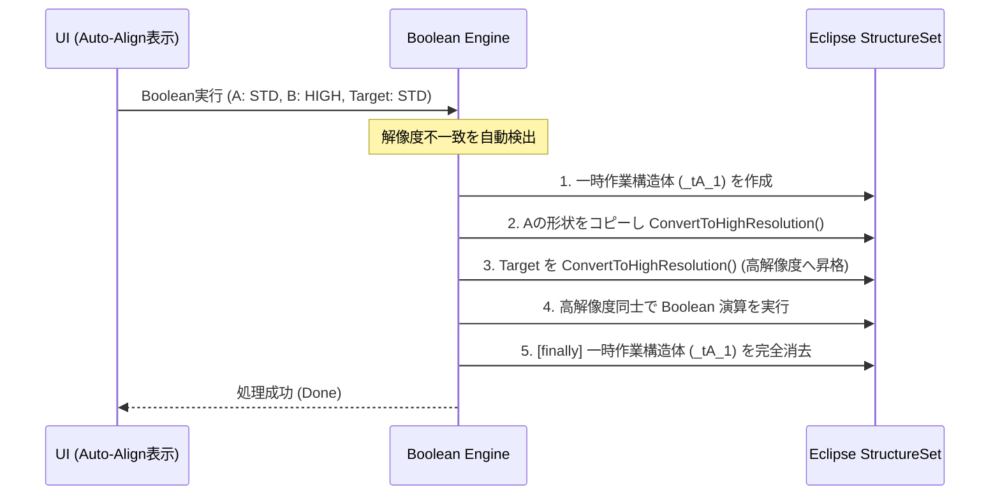

# AutoStructureMaker モジュールリファレンスマニュアル

本ドキュメントは、AutoStructureMaker (v2.0 / Eclipse v15.6・v16.1 対応) で利用可能な**全操作カテゴリー（モジュール）の構文、パラメータ仕様、解像度整合メカニズム、および設定例（XML / CSV）**を体系的にまとめた詳細リファレンスです。

---

## 目次

1. [共通仕様と解像度（Resolution）モデル](#1-共通仕様と解像度resolutionモデル)
   - 1.1 [2種類の輪郭解像度（STD と HIGH）](#11-2種類の輪郭解像度std-と-high)
   - 1.2 [UI 解像度バッジの定義と配色規約](#12-ui-解像度バッジの定義と配色規約)
   - 1.3 [⚡ Boolean Auto-Align（高解像度自動整合）メカニズム](#13--boolean-auto-align高解像度自動整合メカニズム)
   - 1.4 [先行ステップ輪郭伝播（Auto-Propagation）](#14-先行ステップ輪郭伝播auto-propagation)
   - 1.5 [ステップ有効/無効トグル（Enabled 属性）](#15-ステップ有効無効トグルenabled-属性)
2. [Add Structure（新規輪郭追加）](#2-add-structure新規輪郭追加)
   - 2.1 [機能概要](#21-機能概要)
   - 2.2 [パラメータ仕様表](#22-パラメータ仕様表)
   - 2.3 [サポートされている DICOM Type 一覧](#23-サポートされている-dicom-type-一覧)
   - 2.4 [記述例 (XML / CSV)](#24-記述例-xml--csv)
3. [Delete Structure（輪郭削除）](#3-delete-structure輪郭削除)
   - 3.1 [機能概要](#31-機能概要)
   - 3.2 [パラメータ仕様表](#32-パラメータ仕様表)
   - 3.3 [記述例 (XML / CSV)](#33-記述例-xml--csv)
4. [Boolean Operators（輪郭論理演算）](#4-boolean-operators輪郭論理演算)
   - 4.1 [機能概要](#41-機能概要)
   - 4.2 [論理演算タイプと計算式](#42-論理演算タイプと計算式)
   - 4.3 [パラメータ仕様表](#43-パラメータ仕様表)
   - 4.4 [安全保護仕様（空輪郭ガード・承認輪郭保護）](#44-安全保護仕様空輪郭ガード承認輪郭保護)
   - 4.5 [記述例 (XML / CSV)](#45-記述例-xml--csv)
5. [Margin（マージン付加・拡大縮小）](#5-marginマージン付加拡大縮小)
   - 5.1 [機能概要](#51-機能概要)
   - 5.2 [マージン方向と 3次元座標系規約](#52-マージン方向と-3次元座標系規約)
   - 5.3 [等方 / 異方マージンの動作仕様](#53-等方--異方マージンの動作仕様)
   - 5.4 [パラメータ仕様表](#54-パラメータ仕様表)
   - 5.5 [安全保護仕様（空輪郭ガード・承認輪郭保護）](#55-安全保護仕様空輪郭ガード承認輪郭保護)
   - 5.6 [記述例 (XML / CSV)](#56-記述例-xml--csv)
6. [High Res. Segment（高分解能変換）](#6-high-res-segment高分解能変換)
   - 6.1 [機能概要](#62-パラメータ仕様表)
   - 6.2 [パラメータ仕様表](#62-パラメータ仕様表)
   - 6.3 [安全保護仕様](#63-安全保護仕様)
   - 6.4 [記述例 (XML / CSV)](#64-記述例-xml--csv)

---

## 1. 共通仕様と解像度（Resolution）モデル

### 1.1 2種類の輪郭解像度（STD と HIGH）
Varian Eclipse ESAPI において、輪郭（`Structure` クラス）はボクセル表現の解像度として以下の 2 つの解像度タイプを持ちます：

| 解像度タイプ | 内部グリッド | 特徴 | 臨床用途 |
|:---|:---:|:---|:---|
| **Standard Resolution (STD)** | 256 × 256 | メモリ消費が少なく高速。Eclipse 上で標準的に作成される輪郭。 | 膀胱、直腸、肺、肝臓などの一般的な OAR や大まかな標的 |
| **High Resolution (HIGH)** | 512 × 512 | 微細なボクセル表現が可能。境界の凹凸や微小構造を忠実に再現。 | 視神経、視交叉、蝸牛、脊髄などの小体積 OAR や SRS / SBRT の GTV |

> [!IMPORTANT]
> **ESAPI の制約**: ESAPI の基本仕様として、**異なる解像度タイプ同士の Boolean 演算（例: STD の輪郭から HIGH の輪郭を引き算する）は例外エラーを発生させて実行できません**。AutoStructureMaker では、この問題を後述の **Auto-Align 機能** により完全自動で解決しています。

---

### 1.2 UI 解像度バッジの定義と配色規約
ユーザーが各輪郭の解像度タイプおよび作成状態を一目で把握できるよう、UI 上に 4 種類のハイブリッドバッジを表示します：

| バッジ表示 | 背景色 | 状態 | 説明 |
|:---|:---:|:---|:---|
| **`[HIGH]`** | ディープパープル (`#6A1B9A`) | 既存高解像度 | 現在の StructureSet に実在する高解像度輪郭 (512×512) |
| **`[STD]`** | ブルーグレー (`#546E7A`) | 既存標準解像度 | 現在の StructureSet に実在する標準解像度輪郭 (256×256) |
| **`[NEW: STD]`** | フォレストグリーン (`#2E7D32`) | 新規作成（標準） | 先行ステップで新規追加（Add）され、標準解像度として生成される予定の輪郭 |
| **`[NEW: HIGH]`** | ヴィヴィッドパープル (`#7B1FA2`) | 新規作成（高解像度） | 先行ステップで作成され、途中で High Res 化または Auto-Align された予定輪郭 |
| **`[NEW]`** | グリーン (`#2E7D32`) | 完全新規 | どの先行ステップにもまだ定義されていない手打ちの新規輪郭名 |

---

### 1.3 ⚡ Boolean Auto-Align（高解像度自動整合）メカニズム
異なる解像度の輪郭同士で Boolean 操作が行われた場合、AutoStructureMaker は以下の**5段階トランザクション**を自動的に実行します：



1. **解像度チェック**: $A$ と $B$、および出力先（Target）の解像度を比較。すべて同一解像度の場合は直接 ESAPI 演算を実行。
2. **一時作業構造体による昇格**: 低解像度（STD）側の輪郭に対し、一意な一時構造体（例: `_tA_1`）を生成してセグメントをコピーし、`ConvertToHighResolution()` で高解像度化。
3. **出力先の昇格**: Target が低解像度の場合、Target も高解像度へ自動昇格（精度の低下を防止）。
4. **高解像度同士での安全な Boolean 実行**: 両者とも高解像度となった状態で論理演算（Sub / And / Or / Xor）を実行。
5. **確実なクリーンアップ**: `try ... finally` ブロックにより、演算の成否に関わらず一時構造体を StructureSet から確実に削除。

---

### 1.4 先行ステップ輪郭伝播（Auto-Propagation）
ステップを編集する際、先行ステップ（Step $0 \sim i-1$）で作成される輪郭をリアルタイムにシミュレートし、Step $i$ のすべての ComboBox ドロップダウン候補に自動追加します。
- ユーザーは手入力することなく、プルダウンから直前のステップで作った輪郭をワンクリックで選択できます。
- 先行ステップで `ConvertHighRes` された場合は、後続ステップのドロップダウン候補内のバッジも自動的に `[NEW: HIGH]` に切り替わります。
- **無効化ステップの除外**: 後述の `IsEnabled = false` に設定されたステップは、輪郭伝播のシミュレーションから自動除外され、未生成の輪郭が後続候補に誤って現れないよう保護されます。

---

### 1.5 ステップ有効/無効トグル（Enabled 属性）
各操作カードのヘッダー左端に配置されたチェックボックス（または XML の `<Step Enabled="true|false">` 属性）により、特定のステップを一時的に無効化できます：
- **UI 表示**: チェックを外すと、カード全体が半透明（Opacity 0.55）にグレーアウトされ、無効状態であることが直感的に識別できます。
- **実行時のスキップ**: 「▶ RUN」実行時、無効化されたステップは ESAPI への処理を行わず、ステータスが「`Skip`（灰色）」として安全に通過します。
- **テンプレート保存**: XML テンプレートの `<Step>` 要素に `Enabled="false"` として保存され、読み込み時にもその無効化状態が完全に復元されます（省略時は `true` として扱われます）。

---

## 2. Add Structure（新規輪郭追加）

### 2.1 機能概要
StructureSet に対し、指定した輪郭名と DICOM Type を持つ空の輪郭を新規追加します。
- **初期解像度**: Varian ESAPI の仕様に基づき、生成された輪郭は初期状態で **Standard Resolution (STD)** となります。
- **重複防御**: 同一名称の輪郭がすでに StructureSet に存在する場合は、既存輪郭の上書き事故を防ぐため処理を安全にスキップ（Fail）します。

### 2.2 パラメータ仕様表
| パラメータ名 | 型 | 必須 | 既定値 | 説明 |
|:---|:---:|:---:|:---:|:---|
| **TargetStructure** | string | 必須 | - | 作成する輪郭名（半角英数字・アンダースコア推奨、16文字以内） |
| **DicomType** | enum | 必須 | `PTV` | 輪郭の DICOM 種別（後述の全14種から選択） |

### 2.3 サポートされている DICOM Type 一覧
| DICOM Type | 臨床的分類・用途 |
|:---|:---|
| **`PTV`** | 計画標的体積 (Planning Target Volume) |
| **`CTV`** | 臨床標的体積 (Clinical Target Volume) |
| **`GTV`** | 肉眼的腫瘍体積 (Gross Tumor Volume) |
| **`ORGAN`** | リスク臓器・正常組織 (Organ at Risk) |
| **`AVOIDANCE`** | 照射回避領域 (Avoidance Structure) |
| **`CAVITY`** | 術後腔・空洞 (Cavity) |
| **`CONTRAST_AGENT`** | 造影剤領域 (Contrast Agent) |
| **`CONTROL`** | 最適化・線量計算用制御輪郭 (Optimization Control) |
| **`DOSE_REGION`** | 評価用線量関心領域 (Dose Region) |
| **`EXTERNAL`** | 体表面・外形輪郭 (Body / External Outline) |
| **`FIXATION`** | 固定具 (Fixation Device) |
| **`IRRAD_VOLUME`** | 照射体積 (Irradiated Volume) |
| **`SUPPORT`** | 治療台・支持具 (Couch / Patient Support) |
| **`TREATED_VOLUME`** | 治療体積 (Treated Volume) |

### 2.4 記述例 (XML / CSV)
```xml
<!-- XML 形式 -->
<Step Number="1" Type="Add">
  <TargetStructure>PTV_High</TargetStructure>
  <DicomType>PTV</DicomType>
</Step>
```
```csv
# レガシー CSV 形式
AddDelControl,Add,PTV_High,PTV
```

---

## 3. Delete Structure（輪郭削除）

### 3.1 機能概要
不要となった輪郭を StructureSet から恒久的に完全削除します。
- **安全保護**: 医師によって承認（Approved）されている輪郭や、他プランで排他的に使用されている輪郭は ESAPI の安全機能により保護され、削除は行われません。

### 3.2 パラメータ仕様表
| パラメータ名 | 型 | 必須 | 既定値 | 説明 |
|:---|:---:|:---:|:---:|:---|
| **TargetStructure** | string | 必須 | - | 削除対象の輪郭名 |

### 3.3 記述例 (XML / CSV)
```xml
<!-- XML 形式 -->
<Step Number="2" Type="Del">
  <TargetStructure>Temp_Ring_Helper</TargetStructure>
</Step>
```
```csv
# レガシー CSV 形式
AddDelControl,Del,Temp_Ring_Helper,PTV
```

---

## 4. Boolean Operators（輪郭論理演算）

### 4.1 機能概要
2 つの参照輪郭（Structure A と Structure B）に対して 3 次元の幾何ブーリアン演算を行い、結果を Target Structure に格納します。
- Target Structure は事前に作成されている必要があります。
- A と B の解像度が異なる場合でも、**Auto-Align 機能**により高解像度へ自動整合されて安全に実行されます。

### 4.2 論理演算タイプと計算式
| 演算名 | 数式表現 | 意味・臨床用途 |
|:---|:---:|:---|
| **`SUB`** | $A \setminus B$ | **差分（引き算）**: A の体積から B と重複する領域を取り除く。<br>（例: `Bladder - PTV`、`Body - PTV`） |
| **`AND`** | $A \cap B$ | **共通（積集合）**: A と B の両方に重複している重複体積を抽出。<br>（例: `Rectum ∩ PTV` による高線量リスク領域の特定） |
| **`OR`** | $A \cup B$ | **結合（和集合）**: A と B の体積を結合して 1 つの輪郭にする。<br>（例: `CTV_Node + CTV_Primary` による合算 CTV 作成） |
| **`XOR`** | $(A \cup B) \setminus (A \cap B)$ | **排他的論理和**: A と B のいずれか一方のみに含まれる領域を抽出。 |

### 4.3 パラメータ仕様表
| パラメータ名 | 型 | 必須 | 既定値 | 説明 |
|:---|:---:|:---:|:---:|:---|
| **TargetStructure** | string | 必須 | - | 演算結果を書き込む出力先輪郭名 |
| **BooleanOperation** | enum | 必須 | `SUB` | `SUB`, `AND`, `OR`, `XOR` のいずれか |
| **StructureA** | string | 必須 | - | 演算対象の第 1 輪郭 |
| **StructureB** | string | 必須 | - | 演算対象の第 2 輪郭 |

### 4.4 安全保護仕様（空輪郭ガード・承認輪郭保護）
1. **空輪郭（`IsEmpty`）ガード**:
   - `StructureA` または `StructureB` のいずれかにセグメントが存在しない（空の）輪郭が指定された場合、ESAPI 内部例外を防止するため演算を安全にスキップし、ログに `Source structure is empty` 警告を出力します。
2. **承認済み・ロック輪郭への代入保護**:
   - 医師により承認（Approved）された輪郭や、線量計算済みプランで使用中の輪郭を `TargetStructure` に指定した場合、ESAPI 例外を捕捉して `Cannot modify approved or locked structure` のエラーログを出力し、クラッシュを完全防止します。

### 4.5 記述例 (XML / CSV)
```xml
<!-- XML 形式 (Enabled 属性は省略可能で既定は true) -->
<Step Number="3" Type="Boolean" Enabled="true">
  <TargetStructure>Bladder_sub</TargetStructure>
  <BooleanOperation>SUB</BooleanOperation>
  <StructureA>Bladder</StructureA>
  <StructureB>PTV_High</StructureB>
</Step>
```
```csv
# レガシー CSV 形式
BoolOpControl,SUB,Bladder_sub,Bladder,PTV_High
```

---

## 5. Margin（マージン付加・拡大縮小）

### 5.1 機能概要
参照元輪郭（OrigStructure）から 3 次元の拡大（Outer）または縮小（Inner）マージンを計算し、Target Structure にセグメントを生成します。

### 5.2 マージン方向と 3次元座標系規約
Eclipse の患者座標系（DICOM 規格）に基づき、各軸の方向は以下のように定義されます：

```
                    Superior (Z2)
                         ↑
                         │  Anterior (Y1)
                         │   ↗
   Right (X1) ←──────────┼──────────→ Left (X2)
                       ↙ │
          Posterior (Y2) │
                         ↓
                    Inferior (Z1)
```

| 軸記号 | 解剖学的方向 | 説明 |
|:---|:---|:---|
| **`X1`** | **Right (R)** | 患者の右方向マージン [mm] |
| **`X2`** | **Left (L)** | 患者の左方向マージン [mm] |
| **`Y1`** | **Anterior (A)** | 患者の前方向マージン [mm] |
| **`Y2`** | **Posterior (P)** | 患者の後方向マージン [mm] |
| **`Z1`** | **Inferior (I)** | 患者の足（尾）方向マージン [mm] |
| **`Z2`** | **Superior (S)** | 患者の頭方向マージン [mm] |

### 5.3 等方 / 異方マージンの動作仕様
- **等方マージン (Uniform)**: 全方位（R/L/A/P/I/S）に均一なミリメートル値を適用します。
- **異方マージン (Asymmetric)**: 6 方向それぞれに独立したマージン値を設定できます（前立腺の直腸側マージンを詰める、呼吸性移動対策で体軸方向のみマージンを拡大する等）。

### 5.4 パラメータ仕様表
| パラメータ名 | 型 | 必須 | 既定値 | 説明 |
|:---|:---:|:---:|:---:|:---|
| **TargetStructure** | string | 必須 | - | マージン結果を書き込む出力先輪郭名 |
| **OrigStructure** | string | 必須 | - | マージン計算の元となる参照輪郭名 |
| **MarginGeometry** | enum | 必須 | `Outer` | `Outer` (拡大) または `Inner` (縮小) |
| **X1 / X2 / Y1 / Y2 / Z1 / Z2** | int | 必須 | `7` | 各方向のマージン量 [mm] (0 以上の整数) |

### 5.5 安全保護仕様（空輪郭ガード・承認輪郭保護）
1. **空輪郭（`IsEmpty`）ガード**:
   - `OrigStructure` にセグメントが存在しない（空の）輪郭が指定された場合、マージン計算を安全にスキップし、ログに `Source structure is empty: {OrigStructure}` を出力します。
2. **承認済み・ロック輪郭への代入保護**:
   - 出力先 `TargetStructure` が承認済みまたはロック中の場合、上書きを防止して安全に `Fail` 終了します。

### 5.6 記述例 (XML / CSV)
```xml
<!-- XML 形式 (前立腺の典型例: 後方のみ3mm、他は5mm) -->
<Step Number="4" Type="Margin" Enabled="true">
  <TargetStructure>PTV_High</TargetStructure>
  <OrigStructure>CTV</OrigStructure>
  <MarginGeometry>Outer</MarginGeometry>
  <Margins X1="5" X2="5" Y1="5" Y2="3" Z1="5" Z2="5" />
</Step>
```
```csv
# レガシー CSV 形式 (構文: モジュール名, Asymmetry, Target, Orig, Geometry, X1, X2, Y1, Y2, Z1, Z2)
AddMarginControl,Asymmetry,PTV_High,CTV,Outer,5,5,5,3,5,5
```

---

## 6. High Res. Segment（高分解能変換）

### 6.1 機能概要
指定した輪郭を、標準解データ（256×256）から**高解像度セグメント（512×512）へ昇格**させます。
- ESAPI の `structure.ConvertToHighResolution()` を内部で呼び出します。
- 体積が極めて小さい構造や、鋭利な輪郭形状、定位照射（SRS / SBRT）の標的など、ボクセル化誤差を最小限に抑えたい場合に有効です。

### 6.2 パラメータ仕様表
| パラメータ名 | 型 | 必須 | 既定値 | 説明 |
|:---|:---:|:---:|:---:|:---|
| **TargetStructure** | string | 必須 | - | 高解像度化する対象輪郭名 |

### 6.3 安全保護仕様
- 承認済み輪郭または線量計算ロック中輪郭に対して高解像度変換を行おうとした場合、ESAPI 内部例外を捕捉し、安全に `Fail` 終了します。
- 既に高解像度である輪郭に対して実行した場合は、スキップまたは安全に完了します。

### 6.4 記述例 (XML / CSV)
```xml
<!-- XML 形式 -->
<Step Number="5" Type="ConvertHighRes" Enabled="true">
  <TargetStructure>PTV_High</TargetStructure>
</Step>
```
```csv
# レガシー CSV 形式
ConvertHighResControl,HiRes,PTV_High
```
