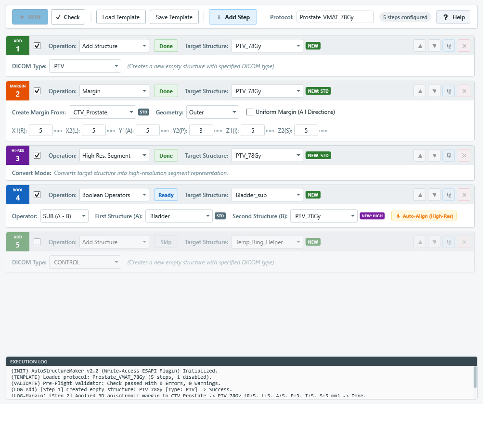

# AutoStructureMaker (v2.0)

[](https://www.varian.com/)
[](https://dotnet.microsoft.com/)
[]()
[](LICENSE)

VARIAN 社製放射線治療計画装置 **Eclipse (v15.6 / v16.1)** 向けの輪郭自動作成・編集支援スクリプト（ESAPI binary-plugin, Write-Access 型）です。

事前に定義された輪郭操作プロトコル（構造化 **XML** または **レガシー CSV**）に基づき、輪郭の新規追加・削除、論理演算（Boolean）、多方向マージン作成、高分解能変換（High-Resolution）などの一連の輪郭作成ワークフローを**完全自動かつ一括で安全に実行**します。

---

## 🖥️ UI スクリーンショット



---

## 🌟 主な機能と特長

- **統合型操作カード UI（旧 4 画面の完全統合）**:
  操作ステップごとに「Add」「Delete」「Boolean」「Margin」「High Res」をドロップダウンで即座に切り替え可能。直感的なモダンカードレイアウトを採用。
- **ステップごとの有効/無効トグル（チェックボックス）**:
  各カードのチェックボックスでステップの有効/無効を瞬時に切り替え可能。無効化されたステップは視覚的にグレーアウトされ、実行時に安全にスキップ（XML テンプレートにも保存）。
- **ワンクリック操作ステップ複製（⧉ 複製ボタン）**:
  各カードの「⧉」ボタンで、現在のパラメータを完全保持したステップを直下に即座に複製・挿入。
- **実行前一括妥当性検査（✔ Check / Pre-Flight Validation エンジン）**:
  「RUN」ボタンを押す前、または実行開始時に、未定義輪郭の参照、空入力、重複作成、自己減算等の課題を瞬時に一括検査して警告・エラーを可視化。
- **直感的なステップ編集（並び替え & 個別削除）**:
  各カードの `▲` / `▼` ボタンで実行順序を瞬時に入れ替え可能。不要なステップは `✕` ボタンでその場で個別削除。
- **ハイブリッド輪郭解像度バッジ表示**:
  - **入力欄横リアルタイムバッジ**: `Target Structure`, `Structure A`, `Structure B`, `OrigStructure` の各入力欄横に、現在の解像度状態（`[HIGH]` / `[STD]` / `[NEW: STD]` / `[NEW: HIGH]`）をカラーバッジとツールチップで即座に可視化。
  - **ドロップダウン内バッジ**: プルダウンを開いた際、各輪郭名の右端に解像度バッジが表示され、選択時に解像度を確認可能。
- **⚡ Boolean Auto-Align（異なる解像度輪郭の自動整合）**:
  ESAPI の制約である「異なる解像度タイプ（Standard 256×256 と High 512×512）同士の Boolean 処理エラー」を根本解決。解像度不一致を自動検出し、一時作業構造体を介して高解像度へ自動整合（Auto-Align）して安全に演算。UI 上にも `⚡ Auto-Align (High-Res)` インジケーターを自動表示。
- **先行ステップ輪郭の自動伝播（手入力不要・オートコンプリート）**:
  先行ステップで新規作成された輪郭名が、後続ステップのドロップダウン候補リストに自動追加され、解像度（`[NEW: STD]` / `[NEW: HIGH]`）も追従表示。タイポ（打ち間違い）を根絶し、ワンクリックで選択可能。
- **空輪郭・ロック中輪郭の完全安全ガード（Zero-Crash Guarantee）**:
  参照元輪郭が空の場合の安全フォールバック、および承認済み（Approved）や線量計算ロック中の輪郭への変更代入時に親切なエラーメッセージを出力し、クラッシュを完全防止。
- **等方 / 異方マージンワンタッチ切り替え**:
  チェックボックス1つで全方向（等方）一括入力モードと、6方向（X1:R, X2:L, Y1:A, Y2:P, Z1:I, Z2:S）個別入力モードをスムーズに切り替え。
- **構造化 XML テンプレート & レガシー CSV 相互互換**:
  メタデータ（プロトコル名・作成者・作成日時・説明）および `Enabled` 属性を伴う堅牢な XML 形式を採用。旧バージョンで作成された CSV パラメータファイルも自動判別して読込・相互保存可能。
- **施設別 XML 設定カスタマイズ (`AutoStructureMaker.config.xml`)**:
  院内ネットワーク共有フォルダ（UNCパス対応・高速フォールバック付き）、デフォルトの DICOM Type、論理演算、マージン設定を外部ファイルで柔軟にカスタマイズ可能。
- **包括的自動単体テスト基盤 (`AutoStructureMaker.Tests`)**:
  ESAPI 非依存のドメインロジックを分離し、57 項目におよぶ自動単体テスト（MSTest）を完備。100% PASS。

---

## 💻 動作要件

| 項目 | 要件 |
|:---|:---|
| **治療計画装置** | Varian Eclipse v15.6 / v16.1 (ESAPI) |
| **実行環境** | .NET Framework 4.6.1 以上 / 64-bit Windows |
| **ESAPI 権限** | Script Approval にて登録・承認済み、かつ Write-Access（データ変更権限）が承認されたアカウント |
| **単体テスト実行** | Visual Studio 2017 / 2019 / 2022、または vstest.console.exe (x64) |

> [!CAUTION]
> 本プラグインは患者データに変更を加える **Write-Access スクリプト** です。臨床運用に投入する前に、必ずテスト用ファントムまたは研究用データセットにて動作検証を実施してください。

---

## 🚀 導入・インストール方法

1. **ビルド成果物の配置**:
   ビルドによって生成された単一バイナリ `AutoStructureMaker.esapi.dll`（Costura.Fody により依存 DLL が内包されています）を、Eclipse が参照可能なスクリプト共有フォルダに配置します。
2. **ESAPI 承認 (Script Approval)**:
   Eclipse 付属の管理者ツール「Script Approval」でスクリプトファイル（`AutoStructureMaker.esapi.dll`）を登録・承認します（患者データを変更するため、Write-Access 権限の承認が必要です）。
3. **設定ファイル (`AutoStructureMaker.config.xml`) の配置**:
   施設固有の初期保存フォルダや既定値を設定した `AutoStructureMaker.config.xml` を、DLL と同一フォルダ、または `%APPDATA%\AutoStructureMaker\` に配置します（配置されていない場合は自動的にデフォルト設定が適用されます）。

---

## 📖 操作方法

1. **スクリプトの起動**:
   Eclipse の「Tools」メニュー →「Scripts」から `AutoStructureMaker.esapi.dll` を選択して実行します。
2. **テンプレートの読み込み**:
   「Load Template」ボタンを押し、保存済みの輪郭操作プロトコル（XML または CSV）を選択します。カード一覧にステップが自動展開されます。
3. **ステップの追加・編集**:
   - 「＋ Add Step」ボタンを押して新規ステップを追加。
   - 各カード上部のドロップダウンで操作カテゴリ（Add, Delete, Boolean, Margin, High Res）を選択。
   - `▲` / `▼` でステップの順序を並び替え、不要なステップは `✕` で削除。
   - 先行ステップで定義された新規輪郭は、後続ステップのドロップダウン候補に自動的に現れます。
4. **ジョブの実行 (RUN)**:
   「▶ RUN」ボタンを押すと、上から順に輪郭処理が自動実行されます。
   各カードのステータス欄に「Done」（緑）または「Fail」（赤）が表示され、下部ログウィンドウに進捗・結果が出力されます。
5. **結果の確認と保存**:
   - 輪郭結果を確定する場合は Eclipse 本体の「Save」機能で保存します。
   - 処理を取り消したい場合は、Eclipse の「Reload」機能で患者を再読み込みしてください。
   - 作成した設定は「Save Template」ボタンで XML または CSV として保存し、再利用できます。

---

## 📝 テンプレートファイルの作成方法

AutoStructureMaker では、可読性と保守性に優れた **XML 形式**（および従来の CSV 形式）をサポートしています。
詳細な仕様および部位別（前立腺、肺SBRT、頭頸部、乳房等）の実践プロトコル例は、[**TEMPLATES.md (テンプレート作成ガイド & 実践サンプル集)**](TEMPLATES.md) を参照してください。

### XML テンプレートの基本構成例

```xml
<?xml version="1.0" encoding="utf-8"?>
<StructureTemplate>
  <ProtocolName>Prostate_VMAT_Standard</ProtocolName>
  <Author>Medical Physics Team</Author>
  <CreatedAt>2026-09-06 14:30:00</CreatedAt>
  <Description>前立腺癌 VMAT 用の自動輪郭作成プロトコル</Description>
  <Steps>
    <!-- Step 1: 新規輪郭 PTV_High の追加 (初期解像度: Standard) -->
    <Step Number="1" Type="Add">
      <TargetStructure>PTV_High</TargetStructure>
      <DicomType>PTV</DicomType>
    </Step>

    <!-- Step 2: CTV から 3次元異方マージンを付加して PTV_High を生成 -->
    <Step Number="2" Type="Margin">
      <TargetStructure>PTV_High</TargetStructure>
      <OrigStructure>CTV</OrigStructure>
      <MarginGeometry>Outer</MarginGeometry>
      <Margins X1="5" X2="5" Y1="5" Y2="3" Z1="5" Z2="5" />
    </Step>

    <!-- Step 3: PTV_High を高解像度セグメントに昇格 -->
    <Step Number="3" Type="ConvertHighRes">
      <TargetStructure>PTV_High</TargetStructure>
    </Step>

    <!-- Step 4: 膀胱 (Standard) から PTV_High (High) を引き算して Bladder_sub を作成 (Auto-Align が自動発動) -->
    <Step Number="4" Type="Boolean">
      <TargetStructure>Bladder_sub</TargetStructure>
      <BooleanOperation>SUB</BooleanOperation>
      <StructureA>Bladder</StructureA>
      <StructureB>PTV_High</StructureB>
    </Step>
  </Steps>
</StructureTemplate>
```

---

## 📚 公式ドキュメント一覧

AutoStructureMaker を安全かつ効率的にご活用いただくための各種ドキュメントを完備しています：

| ドキュメント | 内容 | 対象 |
|:---|:---|:---|
| [**MODULES.md**](MODULES.md) | **全操作モジュール詳細リファレンスマニュアル**<br>全 5 種の操作仕様、引数・パラメータ表、DICOM Type一覧、Boolean演算式、マージン座標系、Auto-Align仕様 | テンプレート作成者 / 臨床ユーザー |
| [**TEMPLATES.md**](TEMPLATES.md) | **テンプレート作成ガイド & 実践サンプル集**<br>XML/CSV仕様、タグ一覧、部位別実践プロトコル例（前立腺・肺SBRT・頭頸部・乳房・全脳） | テンプレート作成者 / 医学物理士 |
| [**TROUBLESHOOTING.md**](TROUBLESHOOTING.md) | **トラブルシューティング & FAQ ガイド**<br>Script Approval、Write-Access エラー、輪郭不一致、Auto-Align の挙動、UNCネットワークパス遅延の解決法 | 臨床運用者 / システム管理者 |
| [**COMMISSIONING.md**](COMMISSIONING.md) | **臨床導入・コミッショニング手順書**<br>AAPM TG-275等に準拠した臨床受入試験項目、ファントムQA、マージン幾何評価、承認記録票 | 品質管理担当 / 医学物理士 |
| [**ARCHITECTURE.md**](ARCHITECTURE.md) | **コード全体構造・アーキテクチャ解説資料**<br>MVVM設計、Auto-Alignパイプライン、先行ステップ輪郭伝播機構、例外安全性、単体テスト基盤 | 開発者 / 技術担当者 |
| [**CONTRIBUTING.md**](CONTRIBUTING.md) | **開発・貢献ガイドライン**<br>ビルド手順、コーディング規約、ゼロクラッシュ例外安全規約、単体テスト方針 | 開発者 / コントリビューター |
| [**CHANGELOG.md**](CHANGELOG.md) | **変更履歴・リリースノート**<br>バージョン別の新機能・変更点・不具合修正の公式記録 | 運用者 / 開発者 |
| [**LICENSE**](LICENSE) | **MIT License** | 利用者全般 |

### カテゴリ別操作早見表

| 操作カテゴリ | 概要 | 主な入力項目 | 特長・安全性機能 |
|:---|:---|:---|:---|
| **Add Structure** | 新規輪郭の作成 | Target Structure, DICOM Type | 既存輪郭との重複を事前防止。初期解像度は Standard (STD)。 |
| **Delete Structure** | 輪郭の削除 | Target Structure | 承認済み輪郭は保護。StructureSet から安全に完全除去。 |
| **Boolean Operators** | 輪郭同士の論理演算 | Target, Op (SUB / AND / OR / XOR), A, B | 異なる解像度同士でも **Auto-Align** により自動高解像度整合して結合。 |
| **Margin** | マージンの付加 | Target, Orig, Geometry (Inner / Outer), 6軸値 | 等方/異方の即時切替。入力値の自動フォールバック機能付き。 |
| **High Res. Segment** | 高分解能輪郭への昇格 | Target Structure | 512×512 の高精細ボクセル表現へ昇格し、微小構造の精度を向上。 |

---

## 👥 著作権・免責事項

- 本ソフトウェアは MIT ライセンスの下で公開されています。商用・非商用問わず自由に利用・改変・再配布が可能です。
- 本スクリプトの使用によって生じたいかなる損害についても、開発者は責任を負いません。臨床適用前に必ず施設内での受入試験（[COMMISSIONING.md](COMMISSIONING.md) 参照）を実施してください。
